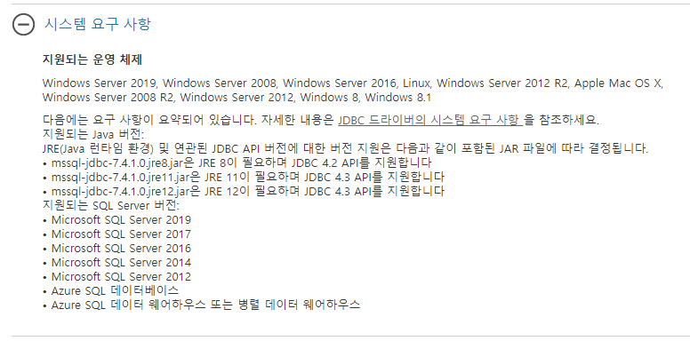
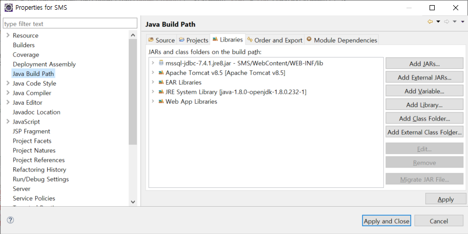

# 문제사항
## 1. java.sql.SQLException: No suitable driver found for jdbc:microsoft:sqlserver://...

해당 에러가 발생했을때 해결하지 못하여 고민을 많이했다.

이것저것 MSDN 문서도 찾아보며 다녔고,



시스템 요구사항도 확인 하였으며, 문제가 없다는 것을 확인했다.

다운로드 링크 : [Microsoft JDBC Driver 7.4 for SQL Server](https://www.microsoft.com/ko-KR/download/details.aspx?id=58505)

해당 파일에서 여러 샘플 데이터들을 다운로드 받을 수 있었다.

그중 눈에 띈 부분은, 샘플 ConnectURL.java 부분이였다.

```{.java}
public static void main(String[] args) {

        // Create a variable for the connection string.
        String connectionUrl = "jdbc:sqlserver://<server>:<port>;databaseName=AdventureWorks;user=<user>;password=<password>";

        try (Connection con = DriverManager.getConnection(connectionUrl); Statement stmt = con.createStatement();) {
            String SQL = "SELECT TOP 10 * FROM Person.Contact";
            ResultSet rs = stmt.executeQuery(SQL);

            // Iterate through the data in the result set and display it.
            while (rs.next()) {
                System.out.println(rs.getString("FirstName") + " " + rs.getString("LastName"));
            }
        }
        // Handle any errors that may have occurred.
        catch (SQLException e) {
            e.printStackTrace();
        }
    }
```

해당 부분을 나의 DB 설정에 맞게 세팅 하였지만, 그대로 문제를 해결하지 못하였다.

다음으로 세팅한 부분은 lib 설정



해당 설정은 eclipse - Project - Java Build Path - Libraries - Add JARs... 를 통하여 다운받은 mssql-jdbc 드라이버를 설정, 적용하여 세팅하였고,

### 마지막으로 
jdk 및 jre가 설치된 폴더에도 해당 jar 파일을 넣었다.

필자는 openjdk 기준이며, oraclejdk의 경로는 적지 않았다.
### JRE : 
C:\Program Files\ojdkbuild\java-1.8.0-openjdk-1.8.0.232-1\jre\lib\ext
### JDK : 
C:\Program Files\ojdkbuild\java-1.8.0-openjdk-1.8.0.232-1\lib\ext

그렇게 적용하여 DB에 있는 값을 불러오는데 성공하였다.
